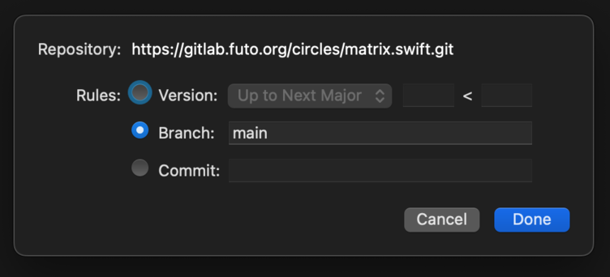

# Matrix.swift - A native Matrix client SDK in Swift

This package provides an (unofficial, third party) native Swift implementation
of the [Matrix](https://matrix.org/) client-server API for writing Matrix
clients on Apple platforms (iOS / MacOS / etc).

Matrix.swift wraps the [Matrix Rust Crypto SDK](https://github.com/matrix-org/matrix-rust-sdk/tree/main/bindings/apple)
to provide support for end-to-end encryption (E2EE).

Main repo: https://gitlab.futo.org/circles/Matrix.swift

Github mirror: https://github.com/futo-org/Matrix.swift

## Status
This project is **beta** quality software.
It is probably not ready for production use by 3rd parties.
However, if you're looking to start a new open source or hobby
project with Matrix on iOS/MacOS, then Matrix.swift is definitely
worth a look.


## Security
Beware that this code has not yet undergone any kind of security audit.  Use it at your own risk.


## Features
Caveats aside, the library currently supports most of the core features needed to build an
E2EE Matrix client.
We are using it as the foundation of the new [Circles for iOS](https://gitlab.futo.org/circles/circles-ios),
which is developed in parallel with this SDK.

Current features include:

**Accounts and Authentication**
* Login and logout
* Registering new accounts
* User-interactive authentication
* Deactivate account
* Higher security cryptographic PAKE authentication with [BS-SPEKE](https://gitlab.futo.org/cvwright/bsspeke)

**Messaging**
* Sending and receiving text, image, and video messages
* Emoji reactions
* Threading
* Uploading and downloading media attachments
* Sync
* Paginating messages in a room
* Event replacement and redaction

**Room Management**
* Enumerating rooms
* Traversing Space hierarchies
* Adding and removing Space parent/child relationships
* Sending, accepting, and rejecting invites
* Knocking, joining, and leaving rooms
* Enumerating room members
* Kicking and banning members

**Encryption**
* Encrypting and decrypting E2EE messages
* Encrypting and decrypting media attachments
* Secret storage
* Cross signing
* Encrypted key backup and recovery

## To-Do List
* ~~Support for Matrix threads~~
* ~~Update to the latest Rust Crypto SDK~~
* ~~Support for redaction and replacement~~
* ~~Use the Keychain to hold secret storage keys on the device~~
* Documentation
* Prepare 1.0 release


## Using Matrix.swift in your app

You can install the library as a Swift package directly from this Git repository.

In your `Package.swift`, include the following lines:
```swift
dependencies: [
    ...
    .package(url: "https://gitlab.futo.org/circles/matrix.swift", branch: "main")
],
targets: [
    .target(
        name: "YOUR TARGET",
        dependencies: [
            ...
            .product(name: "Matrix", package: "Matrix.swift")
        ]
    )
]
```

Or in Xcode, add Matrix.swift to the `Package Dependencies` for your project:


